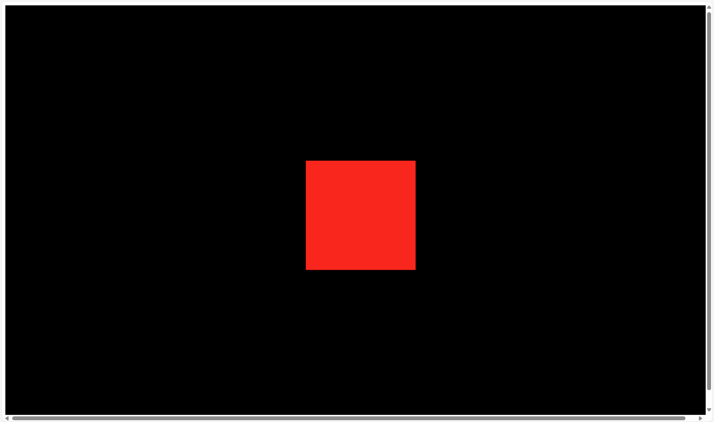

## Responsive sizes
Our canvas currently has a fixed resolution of `800x600`.

We want to make it responsive, so that it can be resized to any size.

We can do this by using the `window.innerWidth` and `window.innerHeight` properties.

```ts
const sizes: { width: number, height: number } = {
    width: window.innerWidth,
    height: window.innerHeight
}
```




The caveat is that we have some white margin on the sides of the canvas and scrollbars. We can fix this by adding the following CSS to the `style.css` file:

```css
/* Remove margin and padding */
*
{
    margin: 0;
    padding: 0;
}

/* Make the canvas full screen */
.webgl
{
    position: fixed;
    top: 0;
    left: 0;
    outline: none;
}

/* Make the html and body full screen */
html,
body
{
    overflow: hidden;
}
```


## Resizing the canvas
So far we cannot resized the canvas. To resize the canvas, we first need to know **when** the window is being resized.  We can listen for the `resize` event on the `window` object.

1. We will add a `resize` event listener to the `window` object.
2. We will update the `sizes` object with the new window width and height.
3. We will update the camera aspect ratio.
4. We will update the renderer size.

```ts
// Resize canvas
window.addEventListener("resize", () => {
    if (!canvas) return;
    // Update sizes
    sizes.width = window.innerWidth;
    sizes.height = window.innerHeight;
    // Update camera
    camera.aspect = sizes.width / sizes.height;
    camera.updateProjectionMatrix();
    // Update renderer
    renderer.setSize(sizes.width, sizes.height);
});
```


## Pixel Ratio
We can see some kind of blurry render and artifacts shaped likes stairs on the edges (called aliasing) as shown below. This is because we are rendering on ma chine with pixel ratio > 1. The pixel ratio corresponds to how many physical pixels you have on the screen for one pixel unit on the software part.


To fix this, we can use the `setPixelRatio` method of the `renderer` object. We use the `Math.min` function to ensure that the pixel ratio is not greater than `2`.
```ts
renderer.setPixelRatio(Math.min(window.devicePixelRatio, 2))
```
Notice the changes below:


## Fullscreen
We want to double click on the canvas to go fullscreen and single click to exit fullscreen. We will use the `dblclick` event to listen for double clicks on the canvas.

Now that we have our event, we need 3 things:

1. A way to know if it's already in fullscreen (`document.fullscreenElement`)
2. A method to go to the fullscreen mode (We will use the `<canvas>` and call the `requestFullscreen()` method)
3. A method to leave the fullscreen mode (`document.exitFullscreen()`)


```ts
window.addEventListener('dblclick', () =>
{
    const fullscreenElement: Document | null = document.fullscreenElement || (document as any).webkitFullscreenElement

    if(!fullscreenElement)
    {
        if(canvas.requestFullscreen)
        {
            canvas.requestFullscreen()
        }
        else if((canvas as any).webkitRequestFullscreen)
        {
            (canvas as any).webkitRequestFullscreen()
        }
    }
    else
    {
        if(document.exitFullscreen)
        {
            document.exitFullscreen()
        }
        else if((document as any).webkitExitFullscreen)
        {
            (document as any).webkitExitFullscreen()
        }
    }
})
```


