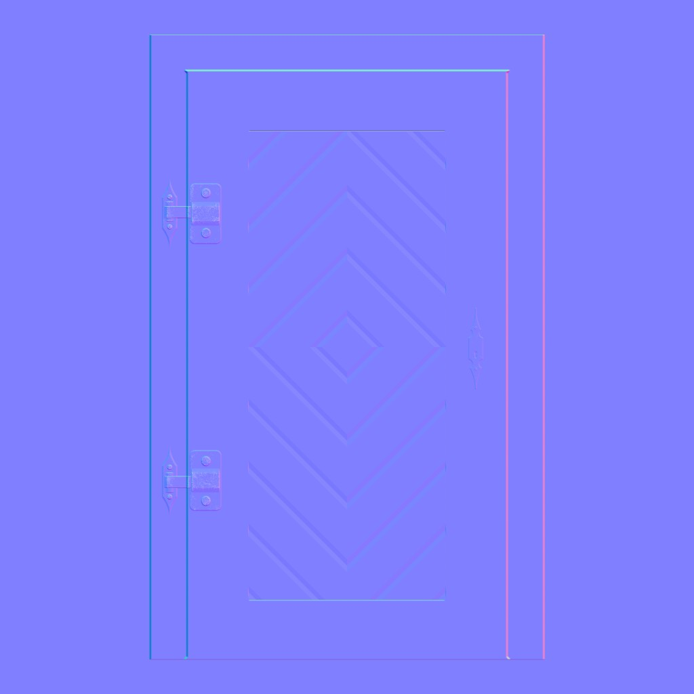
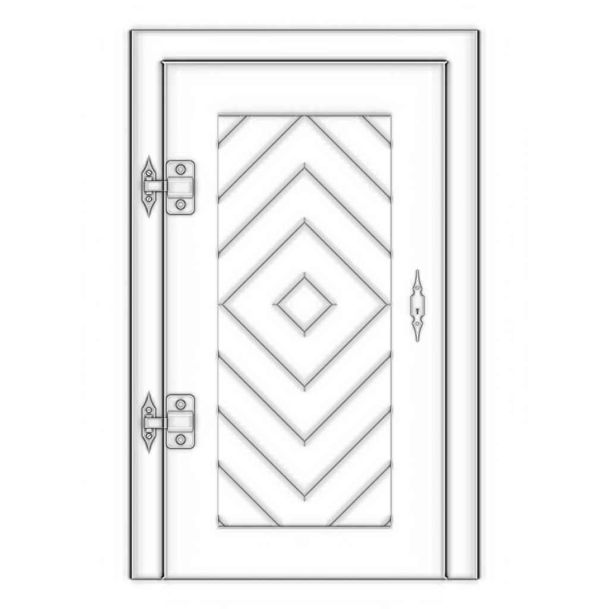
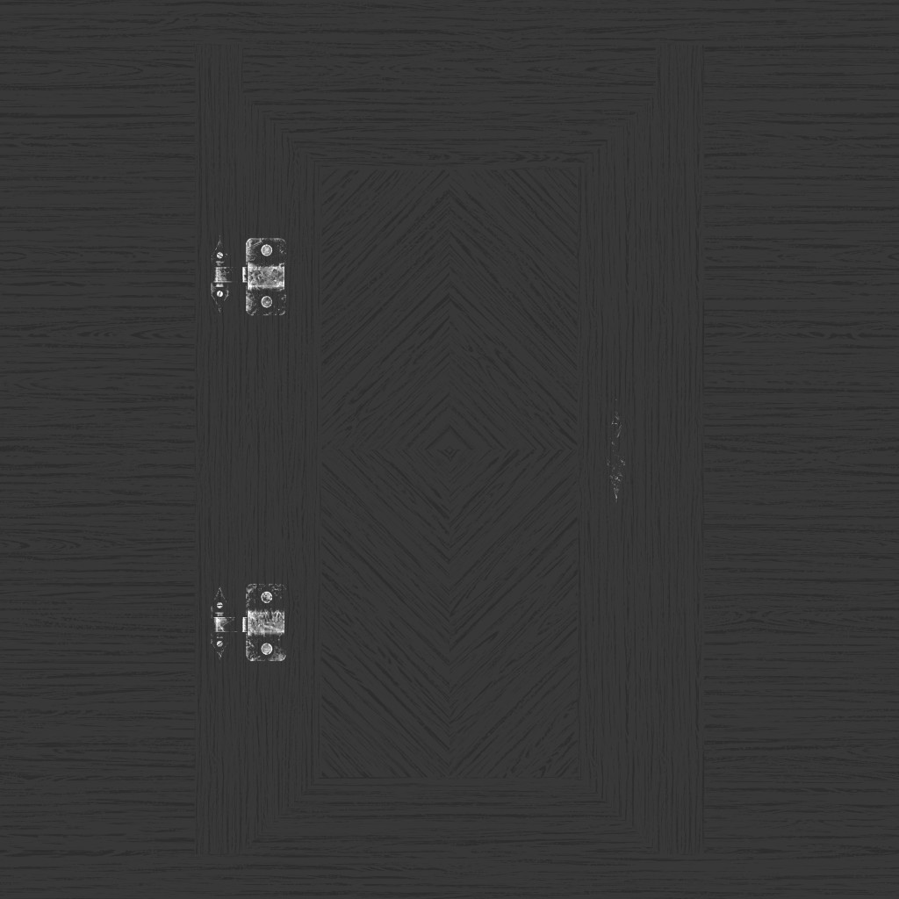

## 1. Types of Textures

### Color (or albedo)
This texture only takes the pixels of the texture and apply them to the geometry.


### Alpha (or mask)
This texture is used to mask the geometry. The white part of the texture will be fully visible, and the black part will be fully transparent.


### Normal Textures
Normal maps (or normal textures) modify the way light interacts with a surface by altering the surface normals. This creates the illusion of complex surface detail and depth without increasing the geometry's polygon count, allowing for realistic details with high performance.



### Height Textures
The height texture is used to simulate the height of the geometry. It is used to create the illusion of depth.


### Ambient Occlusion Textures
An ambient occlusion texture is a grayscale image used to simulate shadows in the crevices and recessed areas of a surface. Although it doesn't provide physically accurate lighting, it enhances visual depth and contrast by darkening areas that would naturally receive less light.



### Metalness Textures
A metalness texture is a grayscale image that determines how metallic a surface appears. White areas are fully metallic, while black areas are fully non-metallic. This texture is used to simulate the metallic properties of a surface.


### Roughness Textures
A roughness texture is a grayscale image that determines how rough a surface appears. White areas are fully rough, while black areas are fully smooth. This texture is used to simulate the roughness properties of a surface.



### PBR(Physically Based Rendering)
PBR is a rendering technique that simulates the physical properties of light and materials to create realistic and visually appealing images. It is based on the principles of physics, such as reflection, refraction, and absorption, to accurately model how light interacts with surfaces.


## 2. Loading Textures
Note that when we put our images in the /static folder, it will only work because of Vite's template configuration.

There are two ways to load textures in Three.js:
1. Using the Image API
2. Using the TextureLoader

### Using the Image API

This is the most basic way to load textures in Three.js. It is a simple way to load textures, but it is not the most efficient way to load textures.

This code demonstrates how to manually load a texture in Three.js using the native `Image API`. First, it creates an `HTMLImageElement` and a corresponding `THREE.Texture` object. The image's source is set to the desired texture file, and once the image has loaded, the code sets the texture's `needsUpdate` property to `true` so that Three.js uploads the image data to the GPU. The color space is set to `sRGB` to ensure accurate color representation. Finally, the loaded texture is assigned to a `MeshBasicMaterial`, which can then be used on a 3D object.

```ts
// Create a new HTMLImageElement instance (not yet in the DOM)
const image: HTMLImageElement = new Image()

// Create a new THREE.Texture instance
const texture: THREE.Texture = new THREE.Texture(image)

// Set the color space to sRGB to ensure correct color representation
texture.colorSpace = THREE.SRGBColorSpace

// Set the texture's image source
// Set the source URL of the image, which starts loading it
image.src = '/textures/door/color.jpg'

// Set a function to run when the image has finished loading
image.onload = () =>
    {
        // This will log to the console once the image is fully loaded by the browser
        console.log('Image loaded successfully!')
    }

// When the image finishes loading, set the texture's needsUpdate flag to true.
// This tells Three.js to upload the new image data to the GPU so the texture is updated.
image.addEventListener('load', () => {
    texture.needsUpdate = true
})

// Create a MeshBasicMaterial and assign the loaded texture to its 'map' property
const material: THREE.MeshBasicMaterial = new THREE.MeshBasicMaterial({ map: texture })
```


### Using the TextureLoader
This code demonstrates how to load textures in `Three.js` using the `TextureLoader` class with a custom `LoadingManager`. The `LoadingManager` provides callbacks for different loading events (`start`, `progress`, `load`, and `error`), allowing you to track the loading process and handle errors. The `TextureLoader` is then created with this manager, and used to load a texture from a file. This approach is more efficient and convenient than manually handling image loading.


```ts
const loadingManager: THREE.LoadingManager = new THREE.LoadingManager()

// Set up event listeners for the loading manager
loadingManager.onStart = () =>
{
    console.log('Loading started!')
}
loadingManager.onProgress = () =>
    {
        console.log('Loading progressing...')
    }
loadingManager.onLoad = () =>
{
    console.log('Loading finished!')
}
loadingManager.onError = () =>
{
    console.log('Loading error!!!')
}

// Create a new TextureLoader instance and pass the loadingManager to it
const textureLoader: THREE.TextureLoader = new THREE.TextureLoader(loadingManager)

// Load the texture using the TextureLoader
const colorTexture: THREE.Texture = textureLoader.load('/textures/door/color.jpg')
colorTexture.colorSpace = THREE.SRGBColorSpace // Set the color space to sRGB to ensure correct color representation
```

## 3. Texture Transformations
The code below sets how a texture is `repeated`, `wrapped`, `offset`, `rotated`, and `filtered` in Three.js. It repeats the texture, sets wrapping modes, offsets and rotates it, disables mipmaps, and uses nearest-neighbor filtering for a pixelated look.

Mipmapping is a technique that generates smaller versions of a texture until we get a 1x1 texture for use when the texture is viewed at a distance or at a small size, reducing aliasing and improving performance. All those texture variations are sent to the GPU, and the GPU will choose the most appropriate version of the texture. Three.js and the GPU already handle all of this, and you can just set what filter algorithm to use. There are two types of filter algorithms: the `minification filter` and the `magnification filter`.

Use mipmapping for most photographic or detailed textures to avoid shimmering and blurring. Disable it (as in this code) for pixel art or low-res textures where sharp, crisp edges are desired.

Use the minification filter to control how the texture is scaled down. The minification filter happens when the pixels of texture are smaller than the pixels of the render. In other words, the texture is too big for the surface, it covers.

The magnification filter works just like the minification filter, but when the pixels of the texture are bigger than the render's pixels. In other words, the texture too small for the surface it covers. The texture gets all blurry because it's a very small texture on a very large surface.

`THREE.NearestFilter` is cheaper than the other ones, and you should get better performances when using it.

Only use the mipmaps for the `minFilter` property. If you are using the `THREE.NearestFilter`, you don't need the mipmaps, and you can deactivate them with `colorTexture.generateMipmaps = false`. 

Note:
Three.js generates progressively smaller versions of a texture—halving the width and height each time—until it reaches a `1x1` pixel texture. For this process to work correctly, the texture’s width and height must each be a power of 2 (such as `512`, `1024`, or `2048`). This requirement ensures that the texture can be evenly divided by `2` at each step.

Examples of valid power-of-two sizes include: `512x512`, `1024x1024`, or `512x2048`.

If you use a texture whose width or height is not a power of `2`, Three.js will attempt to resize it to the nearest power-of-two dimension. This can result in unwanted stretching or artifacts, and you may also see a warning in the browser console.


```ts
// Repeat the texture
// Set how many times the texture repeats horizontally (x) and vertically (y)
colorTexture.repeat.x = 2 // Repeat the texture 2 times along the X axis
colorTexture.repeat.y = 3 // Repeat the texture 3 times along the Y axis
// Set the wrapping mode for the horizontal (S) and vertical (T) axes
colorTexture.wrapS = THREE.RepeatWrapping // Repeat wrapping on the X axis (horizontal)
colorTexture.wrapT = THREE.MirroredRepeatWrapping // Mirrored repeat wrapping on the Y axis (vertical)

// Offset the texture
colorTexture.offset.x = 0.5 // Offset the texture 0.5 units along the X axis
colorTexture.offset.y = 0.5 // Offset the texture 0.5 units along the Y axis

// Rotate the texture
colorTexture.rotation = Math.PI * 0.25 // Rotate the texture by 45 degrees
colorTexture.center.x = 0.5 // Center the texture at the X axis
colorTexture.center.y = 0.5 // Center the texture at the Y axis

// Mipmapping 
colorTexture.generateMipmaps = false // Disable mipmapping for the texture

// 1. Minification Filter
colorTexture.minFilter = THREE.NearestFilter


// 2. Magnification Filter
colorTexture.magFilter = THREE.NearestFilter
```


## References
1. https://marmoset.co/posts/basic-theory-of-physically-based-rendering/
2. https://marmoset.co/posts/physically-based-rendering-and-you-can-too/
3. http://poliigon.com/
4. http://3dtextures.me/
5. http://arroway-textures.ch/
